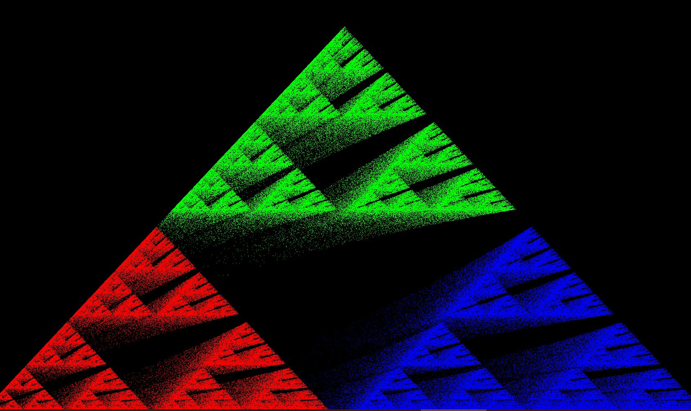
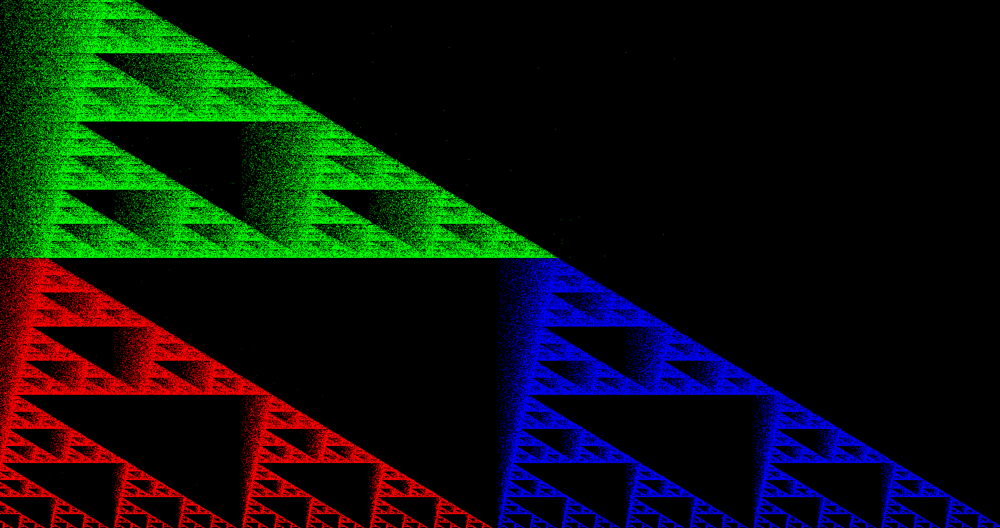
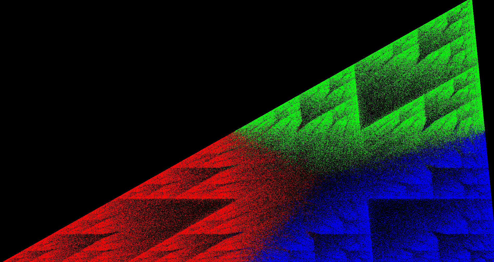
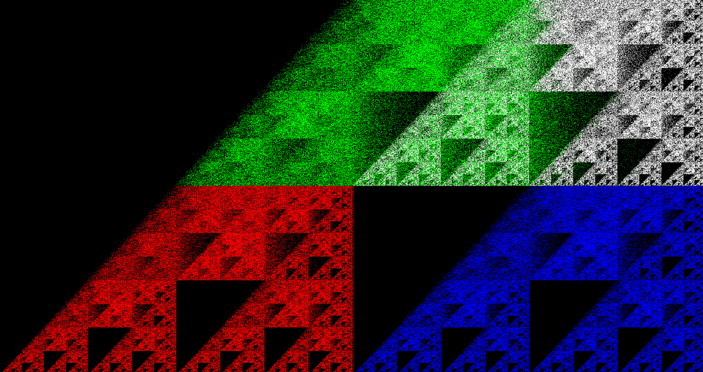
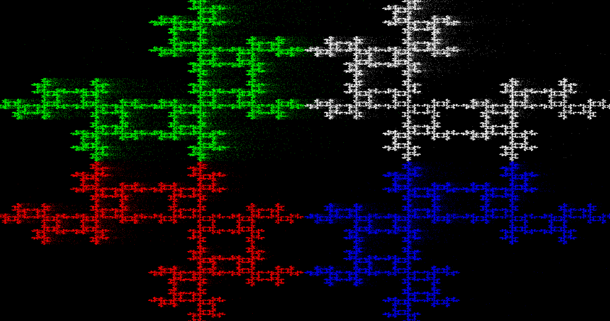

# Cierpinski

A C Sierpinski thingy

## Scale mode (Press S)

## Left right mode (Press L)

## Scale coord mode (Press T)

## Quad mode (Press Q)

## Nodouble mode (Press N)

and some more (like colorless (C), scale vertices (V), etc.)...
## Building

Run the `build.bat` file.
