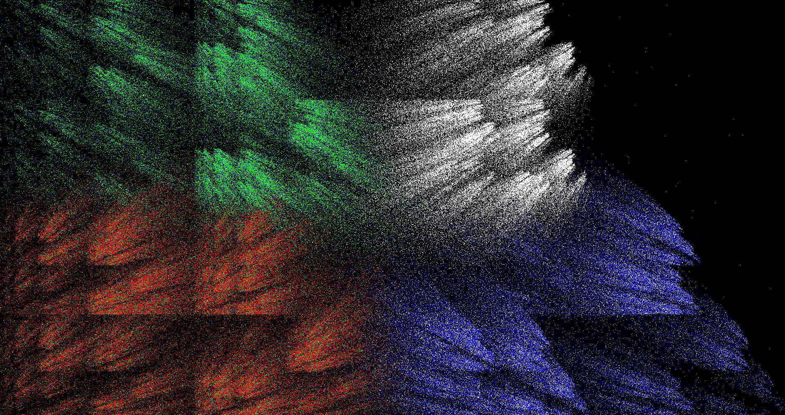

# Cierpinski

A C Sierpinski thingy

## Modes 

| Key | Mode          |
|-----|---------------|
| S   | Scale         |
| L   | Left&Right    |
| T   | Scale Coords  |
| V   | Scale Vertices|
| C   | Color Mode    |
| Q   | Quad Mode     |
| N   | Nodouble      |
| W   | Last+2 Mode   |
| E   | Quad Scale I  |
| R   | Quad Scale II |
| U   | Quad Vertscale|
| P   | Pentagon      |

### Scale mode (Press S)

### Left right mode (Press L)

### Scale coord mode (Press T)

### Quad mode (Press Q)

### Nodouble mode (Press N)

### Quadscale II mode (Press R)

## Building

Run the `build.bat` file.
