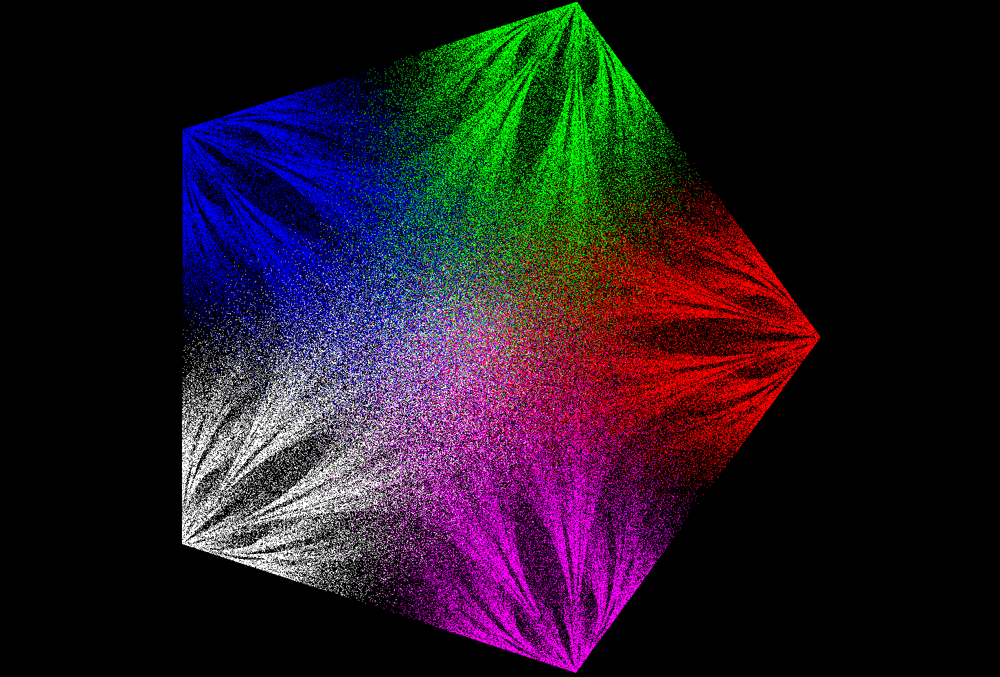

# Cierpinski

A C Sierpinski thingy

## Usage

#### Config

| Key                | Mode                                |
|--------------------|-------------------------------------|
| C                  | Toggle Colors                       |
| R                  | Toggle Random/Clear                 |
| W                  | Increase Speed                      |
| S                  | Decrease Speed                      |
| Up Arrow           | Increase Iterations                 |
| Down Arrow         | Decrease iterations                 |
| Left Arrow         | Increase Vertices                   |
| Right Arrow        | Decrease Vertices                   |

#### Render Mode 

| Key                | Mode                                |
|--------------------|-------------------------------------|
| 0                  | Static mode                         |
| 1                  | Left Right                          |
| 2                  | Scale                               |
| 3                  | Scale Coords                        |
| 4                  | Scale Verts                         |
| 5                  | Rotate clockwise                    |
| 6                  | Rotate counter-clockwise            |
| 7                  | Scale x mode                        |

#### Filter Mode

| Key                | Mode                                |
|--------------------|-------------------------------------|
| shift+1            | None                                |
| shift+2            | No double mode                      |
| shift+3            | Last+2 mode                         |


# Gallery 





## Building

```
clang.exe main.c -luser32 -lgdi32 -lopengl32 -o main.exe
```
or
```
gcc main.c -luser32 -lgdi32 -lopengl32 -o main.exe
```
or
```
cl /std:c11 main.c user32.lib gdi32.lib opengl32.lib
```
